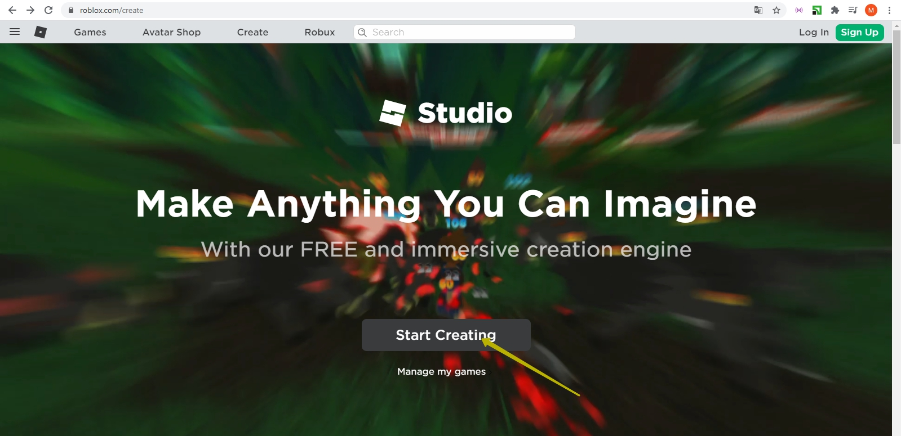
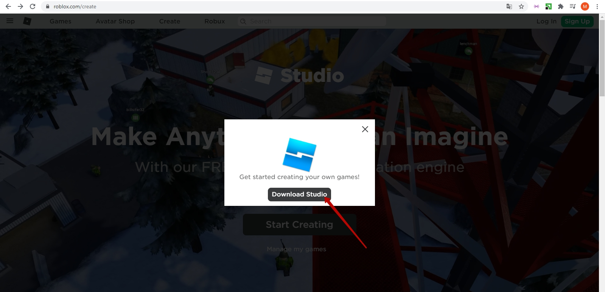
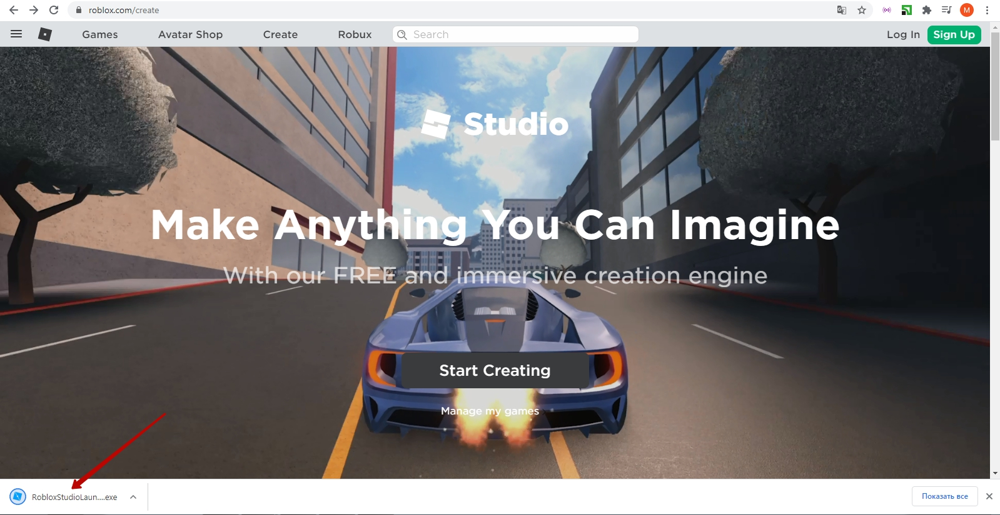
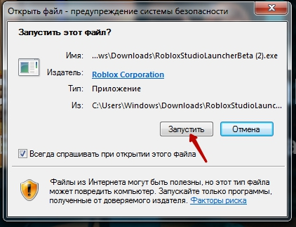
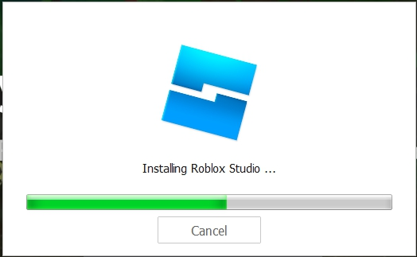
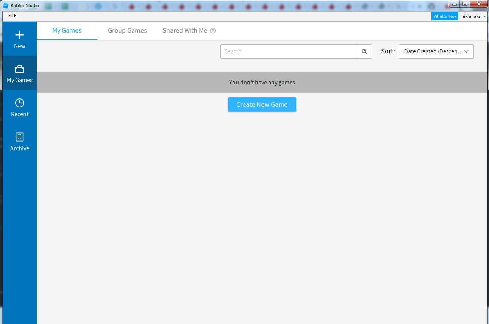

# Roblox - Preparación de una clase de prueba.
## 1. Empieza con Roblox Studio
Vayan a <a href = "https://www.roblox.com/create" target = "_blank">https://www.roblox.com/create</a>  
  
Haga clic en el botón **Start Creating**.

## 2. Descargar el instalador
En la ventana que se abre, haz clic en "Download Studio".  

## 3. Ejecutar el instalador
Inicie la aplicación descargada:   

## 4. Obtener todos los permisos necesarios

## 5. Echa un vistazo a las bases de Roblox Studio para ponerte manos a la obra.

## 6. ¡Estás listo para la clase!

